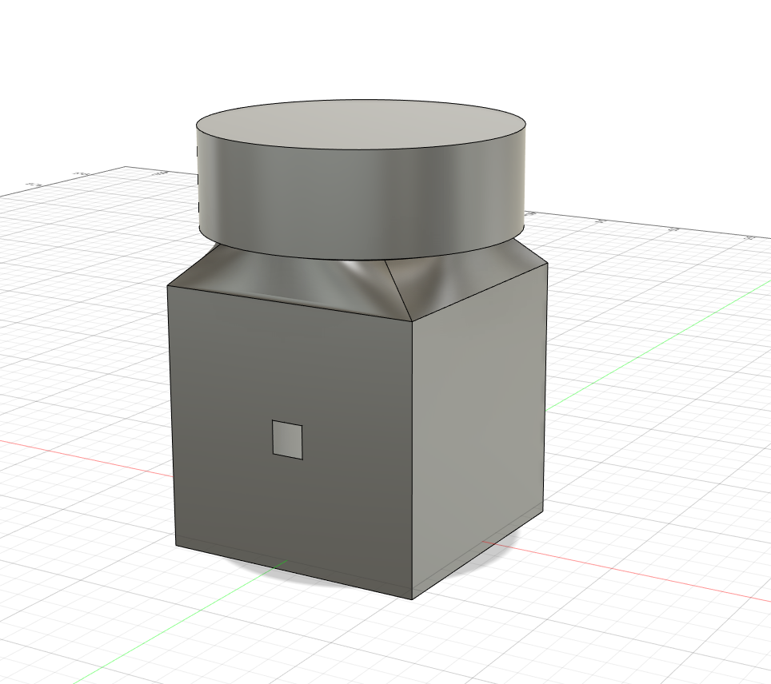

# Solarigraphy – 3D prints

  
&nbsp; &nbsp; &nbsp;
  

### ◾ About the project

**Solarigraphy** is a photography technique that utilizes photography paper to create art representing Sun paths on the sky.

This repository contains *.stl files for 3D printing of two soligraphy cameras.

### ◾ More information
More details and a tutorial (in polish) can be found on my blog: [alicja.space](https://alicja.space)

### ◾ License
The project is available on Creative Commons Attribution Share Alike 4.0 International license (more in [license file](LICENSE.txt)). You are free to use it, modify it and produce as many of your own boards as you need.
